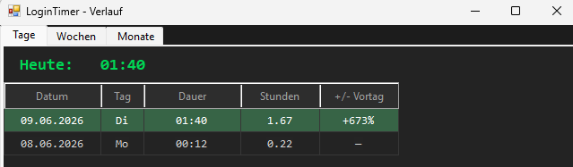
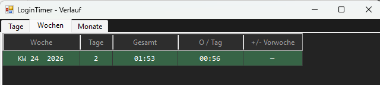
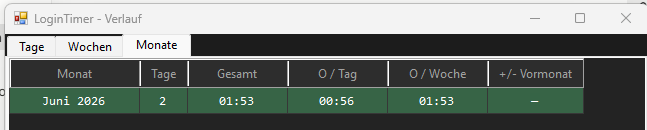

# LoginTimer

**Version 1.1.0**

Windows system tray app that tracks your logged-in time per day — automatically pauses when the screen is locked.

## Screenshots

### Widget & Tray icon
<p float="left">
  
  &nbsp;&nbsp;
  
</p>

The always-on-top widget shows today's time at a glance. The tray icon mirrors the same value and shows a tooltip on hover.

### History — Days


Last 60 days with date, weekday, duration, decimal hours, and % change vs. the previous entry.

### History — Weeks


Last 16 weeks grouped by calendar week — total time, number of active days, average per day, and % change vs. previous week.

### History — Months


Last 12 months — total, days tracked, average per day, average per week, and % change vs. previous month.

---

## Features

- **Auto-tracking** — starts on login, pauses on Windows lock / remote disconnect, resumes on unlock
- **Floating widget** — always-on-top HH:MM display, draggable, position persisted across restarts
- **Tray icon** — live time rendered directly into the icon; right-click menu to toggle widget or quit
- **History window** — days / weeks / months / apps tabs with averages and ±% change indicators
- **Per-app tracking** — every 10 s the topmost visible window per monitor is recorded; works correctly with video on a second monitor while working on the first
- **Double-click** widget or tray icon to open history
- **Plain CSV data store** — `%AppData%\LoginTimer\data.csv` and `apps.csv` (easy to inspect or back up)
- **No admin rights required** — MSI installs per-user; portable EXE needs no installer at all; uses only the .NET Framework built into Windows 10/11

---

## Requirements

- Windows 10 or 11
- .NET Framework 4.x (pre-installed on all supported Windows versions)
- No admin rights needed

---

## Install

### Option A — MSI (recommended)

Download `LoginTimer.msi` from the [latest release](../../releases/latest), double-click, follow the wizard.

- Installs to `%LocalAppData%\LoginTimer\`
- Creates an autostart shortcut (runs on every login)
- Optional desktop shortcut (off by default in the wizard)
- Registers in *Programs and Features* for clean uninstall

### Option B — Portable

Download `LoginTimer.exe`, place it anywhere, run it. No installer needed.  
To autostart: drop a shortcut into `shell:startup`.

### Option C — Lightweight Installer (corporate / restricted machines)

Some corporate environments apply a Group Policy (`DisableMSI`) that blocks
Windows Installer entirely — you get *"The system administrator has set policies
to prevent this installation"* when opening the MSI.

Use `Installer.exe` instead:

1. Copy **`LoginTimer.exe`** and **`Installer.exe`** to the same folder.
2. Run `Installer.exe` — no admin rights, no Windows Installer, no Group Policy
   restrictions.

`Installer.exe` copies the files to `%LocalAppData%\LoginTimer\` and creates
the Autostart shortcut exactly like the MSI does, but as a plain .NET EXE.

---

## Build from source

No Visual Studio required — the build uses the C# compiler that ships with Windows.

### Build everything at once

```bat
build-all.bat
```

Produces all four artifacts in `dist\`:

| Artifact | Used for |
|---|---|
| `dist\LoginTimer.exe` | The application itself |
| `dist\LoginTimer.msi` | Standard install on normal machines |
| `dist\Installer.exe` | Install on machines with `DisableMSI` Group Policy |
| `dist\LoginTimer.zip` | All three bundled — attach to a GitHub release |

Requires [WiX Toolset v3.x](https://github.com/wixtoolset/wix3/releases/latest)
(one-time install, ~30 MB) for the MSI step.

### Build individual artifacts

```bat
scripts\build.bat          # LoginTimer.exe only
scripts\build_msi.bat      # LoginTimer.msi only  (needs LoginTimer.exe first)
scripts\build-installer.bat  # Installer.exe only  (compile; does not run it)
scripts\install.bat        # compile Installer.exe then launch it immediately
```

---

## Usage

| Action | Result |
|--------|--------|
| Double-click widget or tray icon | Open history window |
| Right-click tray icon | Context menu (toggle widget, history, quit) |
| Drag widget | Reposition — saved automatically |
| Lock Windows (`Win+L`) | Timer pauses |
| Unlock | Timer resumes |

---

## Data

Logged time is stored in plain CSV:

```
%AppData%\LoginTimer\data.csv
```

Format: `yyyy-MM-dd,seconds` — one line per day. Safe to copy or delete individual lines.

---

## License

[MIT License](LICENSE) — Copyright (c) 2026 brosenberger
